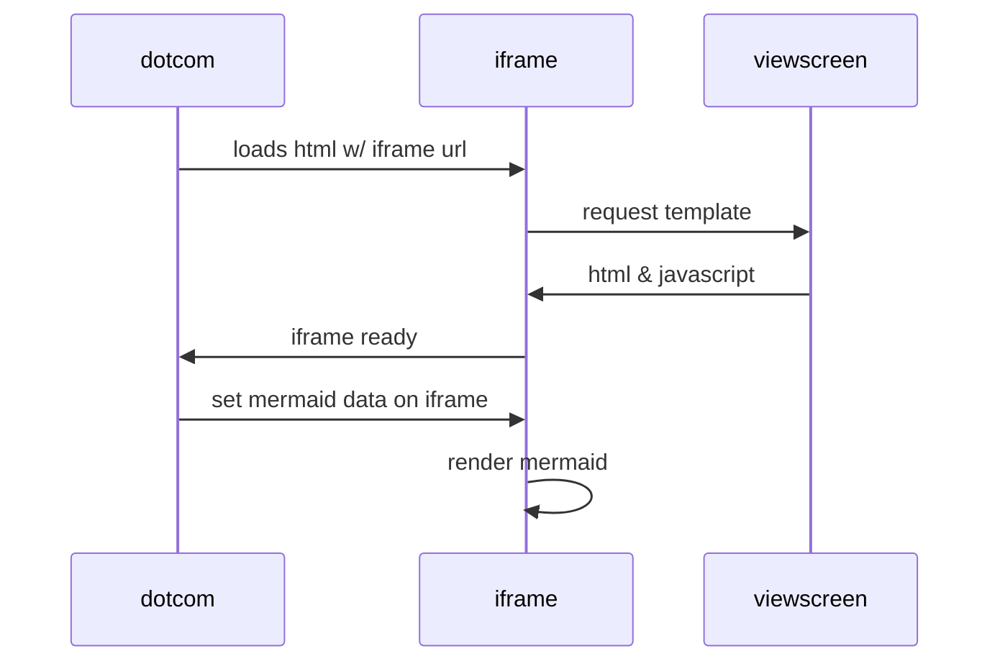

# MkDocs Test Environment


**checking header** adding more content back for ci testing 
 
## Commands

* `mkdocs new [dir-name]` - Create a new project.
* `mkdocs serve` - Start the live-reloading docs server.
* `mkdocs build` - Build the documentation site.
* `mkdocs -h` - Print help message and exit.

## Project layout

    mkdocs.yml    # The configuration file.
    docs/
        index.md  # The documentation homepage.
        ...       # Other markdown pages, images and other files.

## Testing new content after gh-deploy

!!! quote "Checking quotes"

    This is to check whether quote plugin is working
    correctly

some other text


<div class="results" markdown>

???+ Check_1

    text check for drop down

    ```bash
    $ grep...
    ```
    changing to see whether I can revert back from version deploy to `mkdocs gh-deploy`
    

</div>


### Checking versioning : Now changing to v2.0

Checking version 2.0



<br>

--8<-- "docs/images/sismonr_network.html"